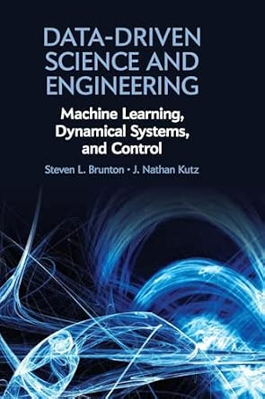

## University of Utah SIAM Student Chapter Data-Driven Modeling Discussion Group

### Target Audience:
- Motivated undergraduate students in math, engineering, computer science, etc.
- Early graduate students in similar fields

### Goals:
- Create a GitHub account
- Learn basic Git commands
- Set up a coding/development enviroment
- Learn Python through applied math examples
- Learn about Data-Driven modeling from Brunton and Kutz's book [Data-Driven Science and Engineering](https://databookuw.com/)
- See coded examples and implement them yourself!

### A talk schedule along with associated code will be posted here and on our SIAM Student Chapter [webpage](math.utah.edu/siamsc)

### The book:

